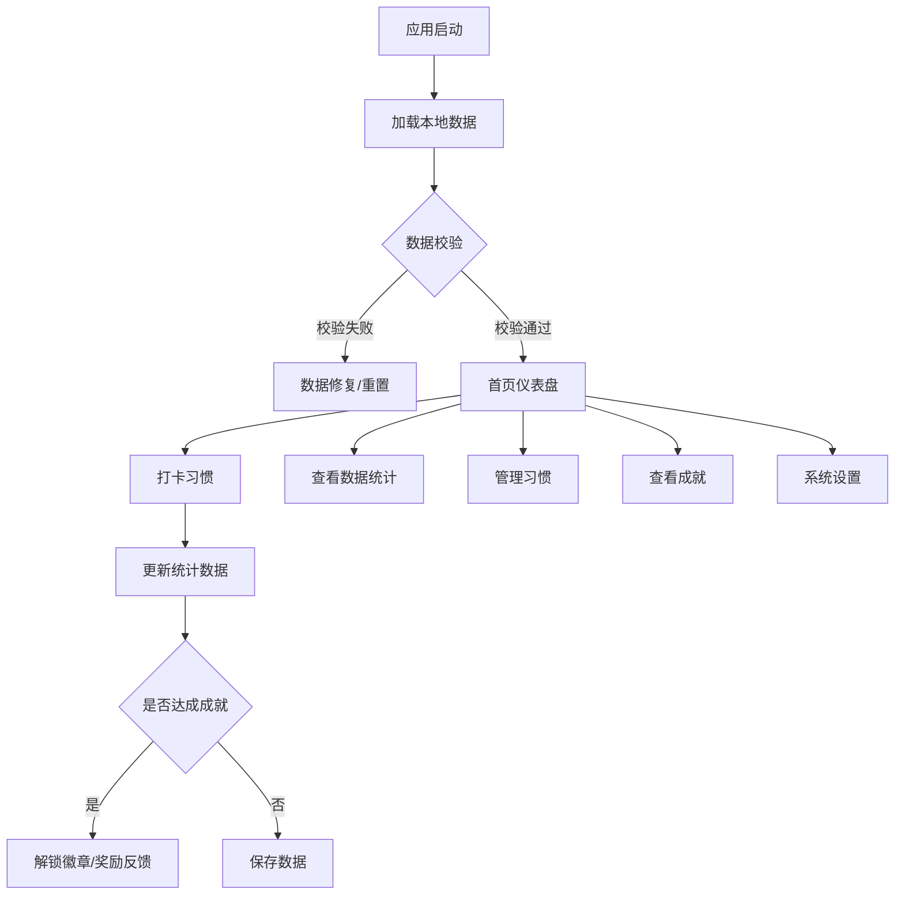

## 1. 产品概述
个人习惯养成与行为追踪系统，帮助用户建立良好习惯、追踪每日行为、通过数据可视化和成就激励系统保持长期坚持动力。

- 面向希望培养良好习惯、提升自我管理能力的个人用户
- 解决习惯难以坚持、缺乏数据反馈、激励机制不足的问题
- 核心价值：科学的习惯追踪+直观的数据洞察+游戏化的成就激励

## 2. 核心功能

### 2.1 用户角色
| 角色 | 注册方式 | 核心权限 |
|------|----------|----------|
| 普通用户 | 无需注册，本地使用 | 习惯管理、数据统计、成就系统、配置管理 |

### 2.2 功能模块
1. **习惯管理**：习惯创建/编辑/删除、每日/每周打卡、连续天数统计
2. **数据可视化**：热力图展示、趋势曲线分析、完成率统计图表
3. **成就系统**：徽章解锁、里程碑奖励、成就展示
4. **智能提醒**：活跃时段分析、个性化提醒、激励推送
5. **数据管理**：本地存储、数据导入导出、离线同步、冲突处理

### 2.3 页面详情
| 页面名称 | 模块名称 | 功能描述 |
|---------|----------|----------|
| 首页仪表盘 | 概览模块 | 今日待完成习惯、连续打卡天数、最近成就、快捷打卡 |
| 习惯管理页 | 习惯列表 | 展示所有习惯、添加/编辑/删除习惯、习惯详情 |
| 数据统计页 | 数据可视化 | 热力图、趋势曲线、完成率图表、周期统计 |
| 成就中心页 | 成就展示 | 已解锁徽章、成就进度、里程碑奖励 |
| 系统设置页 | 配置管理 | 提醒设置、主题切换、数据导入导出、存储空间状态 |

## 3. 核心流程

用户打开应用 → 首页展示今日习惯概览 → 点击习惯进行打卡 → 系统自动更新连续天数和统计数据 → 达成成就时触发徽章解锁 → 用户可随时查看数据统计和成就进度 → 通过设置页个性化配置提醒和主题

## 4. 用户界面设计

### 4.1 设计风格
- **主色调**：深青色渐变（#0ea5e9 → #06b6d4）作为主色，暖橙色（#f97316）作为强调色
- **辅色调**：中性灰（zinc色系）作为背景和文字，确保良好对比度
- **按钮风格**：圆角16px，带有微妙阴影，hover时有轻微上浮动画
- **字体**：展示字体使用 'Plus Jakarta Sans'，正文字体使用 'Inter'
- **布局风格**：卡片式布局，圆角16px，柔和阴影，充足留白
- **图标风格**：lucide-react线性图标，统一24px尺寸
- **背景**：浅色模式下使用轻微渐变背景+细腻噪点纹理，深色模式下使用深色渐变

### 4.2 页面设计概述
| 页面名称 | 模块名称 | UI元素 |
|---------|----------|--------|
| 首页仪表盘 | 概览模块 | 顶部问候语、今日进度环形图、快捷打卡卡片网格、最近成就徽章、连续打卡进度条 |
| 习惯管理页 | 习惯列表 | 顶部添加按钮、习惯卡片（名称、频率、连续天数、打卡按钮）、习惯详情模态框 |
| 数据统计页 | 数据可视化 | 时间范围选择器、热力图组件、趋势曲线图、完成率环形图、统计数据卡片 |
| 成就中心页 | 成就展示 | 成就分类标签、已解锁徽章网格、成就进度条、里程碑奖励展示 |
| 系统设置页 | 配置管理 | 设置项分组卡片、开关组件、颜色主题选择器、数据操作按钮、存储空间指示器 |

### 4.3 响应性
- 桌面端优先（≥1024px）：多列网格布局，侧边导航
- 平板端（768px-1023px）：两列布局，底部导航
- 移动端（<768px）：单列布局，底部Tab导航，卡片紧凑化
- 触摸优化：按钮最小尺寸44x44px，足够的点击间距

### 4.4 动画与交互
- 页面加载：元素渐入+轻微上移，stagger延迟100ms
- 打卡动画：圆形进度条填充动画+缩放反馈+粒子效果
- 徽章解锁：模态框弹出动画+光晕效果+彩带飘落
- 数据图表：渐入动画+数据点依次点亮
- 悬停状态：卡片轻微上浮+阴影加深+背景色微妙变化
