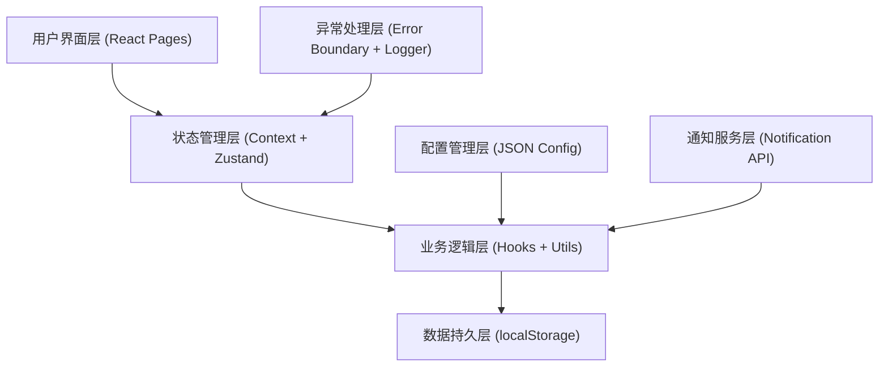
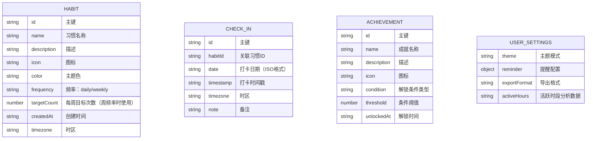

## 1. 架构设计



## 2. 技术描述

- **前端框架**：React 18 + TypeScript + Vite
- **状态管理**：Zustand（全局状态）+ React Context（主题配置）
- **路由管理**：React Router v6
- **样式方案**：TailwindCSS 3 + CSS Variables
- **图表库**：Chart.js + react-chartjs-2
- **图标库**：lucide-react
- **数据存储**：浏览器 localStorage
- **构建工具**：Vite 5
- **类型检查**：TypeScript 5
- **代码规范**：ESLint + Prettier

## 3. 路由定义

| 路由路径 | 页面名称 | 功能描述 |
|---------|----------|----------|
| / | 首页仪表盘 | 今日习惯概览、快捷打卡、数据统计卡片 |
| /habits | 习惯管理 | 习惯列表、添加/编辑/删除习惯 |
| /analytics | 数据统计 | 热力图、趋势曲线、完成率分析 |
| /achievements | 成就中心 | 徽章展示、成就进度、里程碑奖励 |
| /settings | 系统设置 | 提醒配置、主题切换、数据管理 |

## 4. 数据模型

### 4.1 核心数据结构



### 4.2 TypeScript 类型定义

```typescript
type Frequency = 'daily' | 'weekly';

interface Habit {
  id: string;
  name: string;
  description: string;
  icon: string;
  color: string;
  frequency: Frequency;
  targetCount: number;
  createdAt: string;
  timezone: string;
}

interface CheckIn {
  id: string;
  habitId: string;
  date: string;
  timestamp: string;
  timezone: string;
  note?: string;
}

interface Achievement {
  id: string;
  name: string;
  description: string;
  icon: string;
  condition: 'streak' | 'totalCheckins' | 'perfectWeek' | 'habitsCount';
  threshold: number;
  unlockedAt?: string;
}

interface UserSettings {
  theme: 'light' | 'dark' | 'system';
  reminder: {
    enabled: boolean;
    defaultTime: string;
    smartReminder: boolean;
  };
  exportFormat: 'json' | 'csv';
  activeHours: number[];
}

interface AppConfig {
  defaultReminderTime: string;
  themeColors: Record<string, { primary: string; secondary: string; accent: string }>;
  exportFormats: string[];
  achievements: Omit<Achievement, 'unlockedAt'>[];
}
```

## 5. 项目结构

```
src/
├── components/          # 通用组件
│   ├── HabitCard.tsx
│   ├── CheckInButton.tsx
│   ├── HeatMap.tsx
│   ├── TrendChart.tsx
│   ├── CompletionRateChart.tsx
│   ├── Badge.tsx
│   ├── StatsCard.tsx
│   ├── Navbar.tsx
│   ├── Sidebar.tsx
│   ├── Modal.tsx
│   └── LoadingSpinner.tsx
├── pages/              # 页面组件
│   ├── Dashboard.tsx
│   ├── Habits.tsx
│   ├── Analytics.tsx
│   ├── Achievements.tsx
│   └── Settings.tsx
├── hooks/              # 自定义Hooks
│   ├── useHabits.ts
│   ├── useCheckIns.ts
│   ├── useAchievements.ts
│   ├── useReminder.ts
│   ├── useLocalStorage.ts
│   ├── useTheme.ts
│   └── useDataValidation.ts
├── utils/              # 工具函数
│   ├── dateUtils.ts
│   ├── storage.ts
│   ├── logger.ts
│   ├── validator.ts
│   ├── exportUtils.ts
│   ├── achievementCalculator.ts
│   └── syncManager.ts
├── context/            # React Context
│   ├── ThemeContext.tsx
│   └── ConfigContext.tsx
├── store/              # Zustand Store
│   └── useAppStore.ts
├── types/              # TypeScript类型
│   └── index.ts
├── config/             # JSON配置
│   └── appConfig.json
├── App.tsx
├── main.tsx
└── index.css
```

## 6. 核心模块说明

### 6.1 数据校验模块 (validator.ts)
- 习惯名称非空校验
- 频率值枚举校验（daily/weekly）
- 日期格式ISO标准校验
- 统计数据一致性校验
- 时区格式校验

### 6.2 存储管理模块 (storage.ts)
- localStorage 封装
- 存储空间监控与预警
- 数据序列化与反序列化
- 离线数据缓存
- 冲突检测与自动合并

### 6.3 日期工具模块 (dateUtils.ts)
- 时区转换处理
- 跨日期边界处理
- 连续天数计算
- 周/月/年统计
- 活跃时段分析

### 6.4 日志模块 (logger.ts)
- 分级日志（info/warn/error）
- 错误栈捕获
- 本地日志存储
- 异常上报封装

### 6.5 成就计算模块 (achievementCalculator.ts)
- 连续天数统计
- 总打卡次数统计
- 完美周检测
- 成就条件匹配
- 徽章解锁触发

## 7. 异常处理策略

1. **数据加载异常**：捕获JSON解析错误，执行数据修复或重置
2. **存储异常**：捕获QuotaExceededError，触发存储空间预警
3. **时区异常**：检测无效时区，降级为本地时区
4. **并发冲突**：使用时间戳优先策略处理重复打卡
5. **离线同步**：版本号+时间戳双重检测，自动合并冲突数据
6. **全局异常**：React Error Boundary 捕获组件渲染异常
